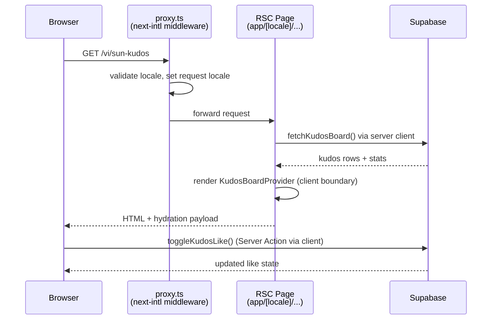
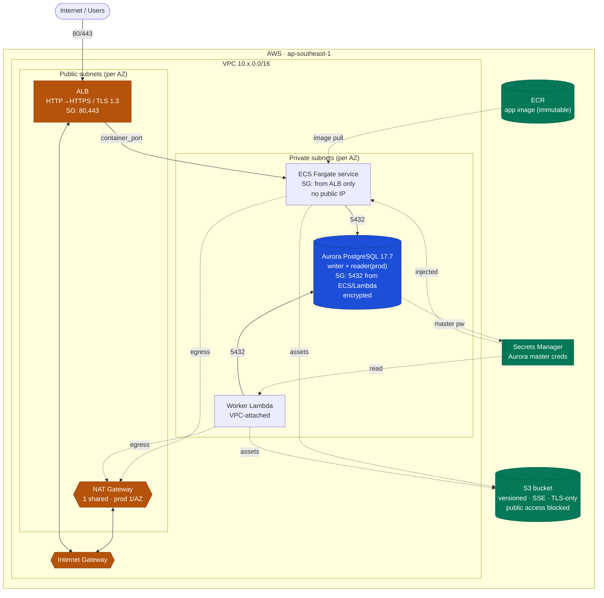
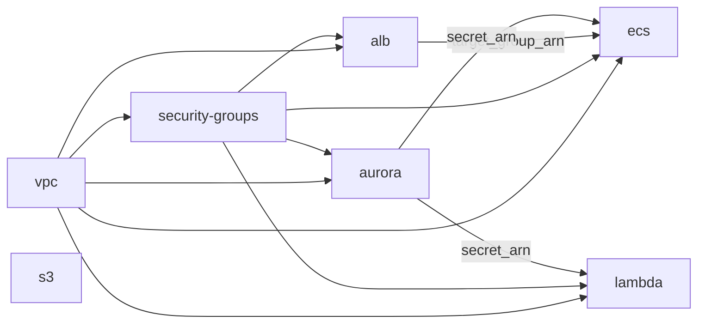

# System Architecture

## Application Architecture

### Overview

SAA 2025 is a **Next.js 16.2.6 App Router** application with server-first rendering, bilingual routing via **next-intl 4.12**, and **Supabase** as the database and (future) auth backend. Today the app deploys to **Vercel**; the AWS Terraform stack in `infra/` provisions the production-grade cloud infra when the team migrates off Vercel.

```
Browser  →  proxy.ts (next-intl middleware)  →  Next.js RSC pages  →  Supabase (PostgreSQL)
```

### Route Map

| Route | Auth required | Description |
|-------|:---:|-------------|
| `/[locale]` | No | Home: hero, ROOT FURTHER section, awards grid, kudos preview, footer |
| `/[locale]/login` | No | Mock Google OAuth, full-bleed keyvisual, bilingual |
| `/[locale]/sun-kudos` | Yes | Kudos live board — send, highlight, spotlight, all-kudos feed, sidebar stats |
| `/[locale]/awards-information` | Yes | Awards detail blocks (×6, alternating layout), sidebar nav |
| `/[locale]/about-saa-2025` | No | Placeholder (coming soon) |
| `/[locale]/prelaunch` | No | Full-screen LED countdown; derives event date from `lib/event.ts` |
| `/[locale]/admin-dashboard` | Yes (admin) | Stub — role === "admin" only |

### Server / Client Component Boundary

- **Default:** all components are React Server Components (RSC). Data is fetched server-side and passed down as props or via React context providers.
- **"use client"** is applied only for interactivity: `KudosBoardProvider`, `MockAuthProvider`, `ComposeModalProvider`, like-button optimistic updates, compose modal, auth guard.
- Pattern: RSC page fetches data → passes to a client Context provider → child client components consume context.

### Data Layer

**Supabase clients**

| Client | File | Usage |
|--------|------|-------|
| Browser | `lib/supabase/client.ts` | `createBrowserClient` — client components |
| Server / RSC | `lib/supabase/server.ts` | `createServerClient` with cookie session — RSC, Server Actions |

Generated TypeScript types from the DB schema live in `lib/supabase/types.ts`.

**Database tables (8)**

| Table | Key columns |
|-------|-------------|
| `users` | id, role (regular\|admin), department_id, avatar_url |
| `departments` | id, name |
| `hashtags` | id, slug, label |
| `awards` | slug, title, prize_count, unit_label, prize_value, display_order |
| `notifications` | user_id, message, read_at |
| `kudos` | sender_id, receiver_id, title, content, is_anonymous, anonymous_name, image_urls (text[]) |
| `kudos_hashtags` | kudos_id, hashtag_id (M:N join) |
| `kudos_likes` | kudos_id, user_id, weight (1\|2) |

**Key queries and actions (`lib/kudos/`)**

- `queries.ts` — `fetchKudosBoard()` (parallel 6-table fetch, computes hero badges), `fetchKudosStats(userId)`
- `actions.ts` — `toggleKudosLike()`, `createKudos()` (validates, resolves hashtag slugs → ids, compensating delete on link failure); calls `revalidatePath()` after mutations
- `compose-validation.ts` — `isComposeInputValid()` (client) + `assertValidCreateKudosInput()` (server): shared DRY validation
- `hero-badge.ts` — `heroRankFromReceived()` thresholds: 10 → Rising 1★, 20 → Super 2★, 50 → Legend 3★

### i18n Setup

- Locales: `vi` (default), `en`; `localePrefix: "always"` — all URLs include locale segment
- Middleware: `proxy.ts` at repo root — next-intl middleware matching all routes except `/api`, `/_next`, `/_vercel`, static files
- Config: `lib/i18n/routing.ts` (locales, defaultLocale), `lib/i18n/request.ts` (loads `messages/{locale}.json`), `lib/i18n/navigation.ts` (typed `Link`, `redirect`, `useRouter`, `usePathname`)
- Message namespaces: `nav`, `header`, `hero`, `rootFurther`, `awards`, `kudosSection`, `footer`, `widget`, `notifications`, `login`, `awardsInfo`, `kudos.*`, `prelaunch`
- Next.js 16 convention: route params are `Promise<{locale}>` (must `await` before use); pages call `setRequestLocale(locale)` + `hasLocale()` validation; `generateStaticParams()` pre-renders both locales

### Auth Model

- **Current:** mock auth via `lib/auth/mock-auth-context.tsx` — client context exposing `isAuthenticated`, `role`, `displayName`, `signIn()`, `signOut()`. Demo user IDs: `REGULAR=...0001`, `ADMIN=...0002`.
- **Guard:** `lib/auth/auth-guard.tsx` — client component that redirects to `/login` if not authenticated.
- **RLS:** Supabase Row Level Security policies are permissive (demo mode). Real auth integration and strict RLS are a planned follow-up.

### Request Flow Diagram



> **Deployment note:** The app currently deploys to Vercel (`.vercel/` present in repo). The AWS Terraform stack below provisions an alternative production infra (ECS Fargate + Aurora) for teams migrating off Vercel.

---

## AWS Infrastructure (Terraform)

IaC lives in `infra/` — reusable modules under `infra/modules/` composed per environment under
`infra/envs/{dev,staging,prod}/`. Region: **ap-southeast-1**. Provider: `hashicorp/aws ~> 5.0`.
State is stored in per-environment S3 backends with DynamoDB locking (`backend.tf`).

### Topology

```
Internet
   │  80/443
   ▼
[ ALB ]  (public subnets, SG: 80/443 from allowed CIDRs)
   │  container_port (HTTP→HTTPS redirect when cert set)
   ▼
[ ECS Fargate service ]  (private subnets, SG: from ALB only, no public IP)
   │  5432
   ▼
[ Aurora PostgreSQL 17.7 ]  (private subnets, SG: 5432 from ECS + Lambda only)

[ Worker Lambda ]  (VPC-attached, private subnets) ──5432──► Aurora
[ S3 bucket ]  (private, TLS-only, versioned, SSE)
NAT Gateway(s) provide private-subnet egress; ECR holds the app image.
Aurora master password is generated and stored in Secrets Manager.
```

### Diagram (Mermaid)



Module dependency graph (Terraform `module` wiring per env):



### Modules

| Module | Responsibility |
|--------|----------------|
| `vpc` | VPC, public/private subnets across N AZs, IGW, NAT (single shared or one-per-AZ), route tables, optional flow logs |
| `security-groups` | Layered SGs — ALB→ECS→RDS chain via source-SG references (no CIDR on DB port); Lambda→RDS |
| `aurora` | Aurora PostgreSQL cluster + instances, DB subnet group, Secrets-Manager-managed credentials, storage encryption, enhanced monitoring |
| `alb` | Application LB, IP target group (Fargate), HTTP/HTTPS listeners (TLS 1.3), optional access logs |
| `ecs` | Fargate cluster, task definition, service (deployment circuit breaker), ECR (immutable + scan-on-push + lifecycle), IAM exec/task roles, CloudWatch logs |
| `s3` | Bucket with versioning, SSE, full public-access block, TLS-only bucket policy, lifecycle expiry |
| `lambda` | VPC-attached function, IAM role, CloudWatch logs, exactly-one deployment-source guard |

### Environment profiles

| | Dev | Staging | Prod |
|---|-----|---------|------|
| AZs / NAT | 2 AZ / 1 NAT | 2 AZ / 1 NAT | 3 AZ / 3 NAT (HA) |
| Aurora | db.t4g.medium ×1 | db.r6g.large ×1 | db.r6g.xlarge ×2 (writer+reader) |
| Fargate | 0.25vCPU/0.5GB ×1 | 0.5vCPU/1GB ×2 | 1vCPU/2GB ×3 |
| Deletion protection | off | off | on (Aurora + ALB) |
| Flow logs | off | on | on |

### Security posture

- ECS tasks have **no public IP**; only the ALB is internet-facing.
- DB reachable **only** from ECS/Lambda SGs — never `0.0.0.0/0` on 5432.
- Aurora storage encrypted; password never hardcoded (random + Secrets Manager).
- S3: all four public-access blocks, `BucketOwnerEnforced`, TLS-only policy.
- Prod ALB **fails plan** unless an ACM certificate is supplied (no cleartext prod traffic).
- CloudWatch log groups support optional CMK encryption (`log_kms_key_id`).

### Deploy prerequisites

1. Bootstrap state backends (`webapp-tf-state-{env}` S3 + `webapp-tf-locks-{env}` DynamoDB).
2. Set a Lambda deployment source (`lambda_package_path` or S3) per env.
3. Set `alb_certificate_arn` for prod.

> Cost estimates per environment: see [infra-cost-breakdown.md](./infra-cost-breakdown.md).
